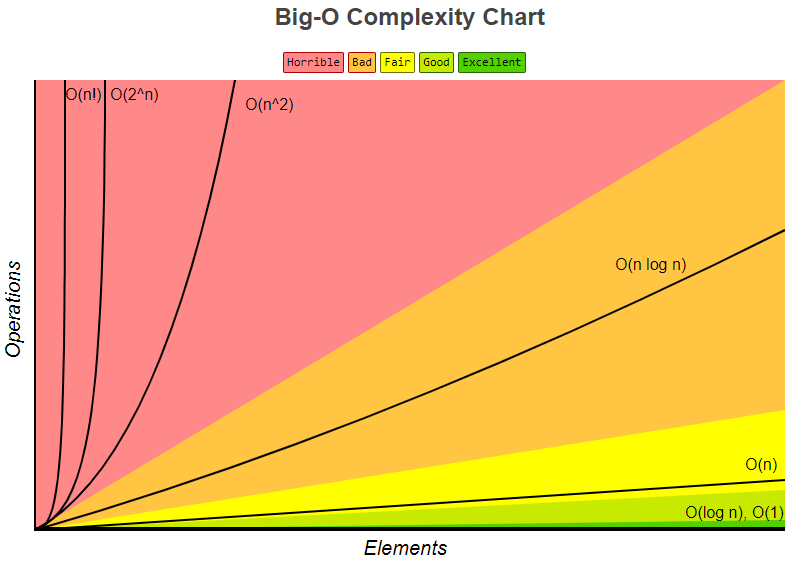

## 大O表示法

大O表示法是用来更简单有效的确认算法效率的方式：

算法的效率主要统计实现上指令的执行个数，简单记忆就是随着负载（n）的增加效率的曲线变化。在计算上指令的执行个数忽略：**常数**（不管数值大小），**低阶**（只需取高阶，即便是log5^n也记忆成logn）。

* 时间复杂度：考虑执行时间
* 空间复杂度：考虑内存占用，比如是否有数组的使用；

提高算法效率的方式：

* 空间换时间
* 时间换空间

常用的大O表示法比较：
O(1)<O(logn)<O(n)<O(nlogn)<O(n^2)<O(2^n)<O(n!)

参考：
[Big-O Cheat Sheet](bigocheatsheet.com)